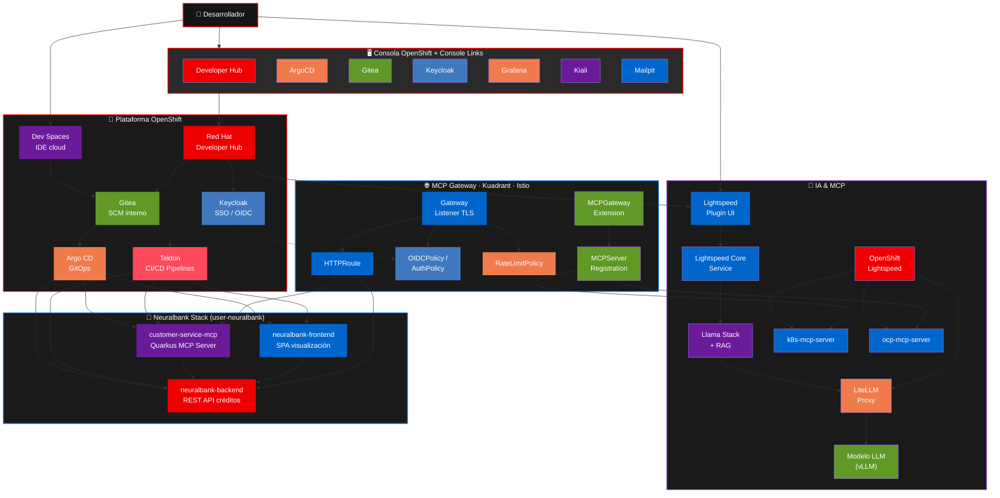
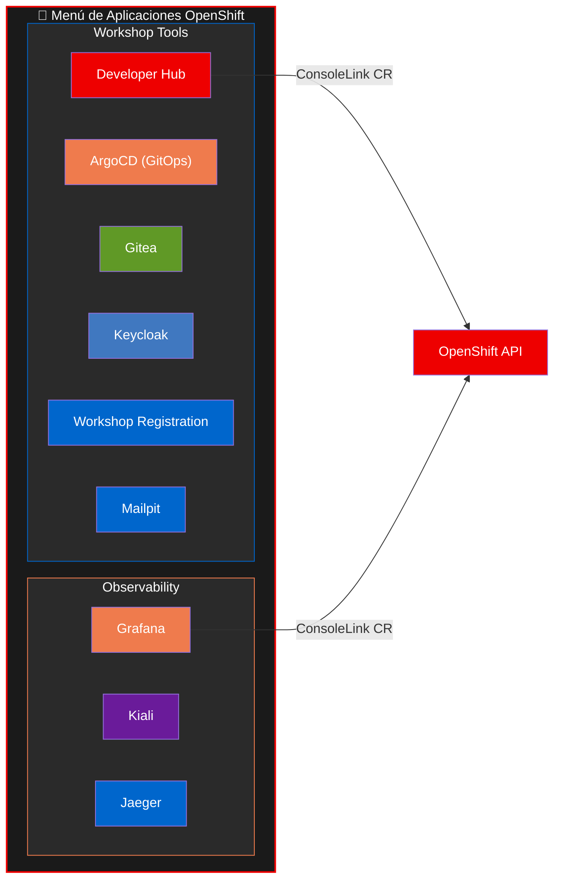
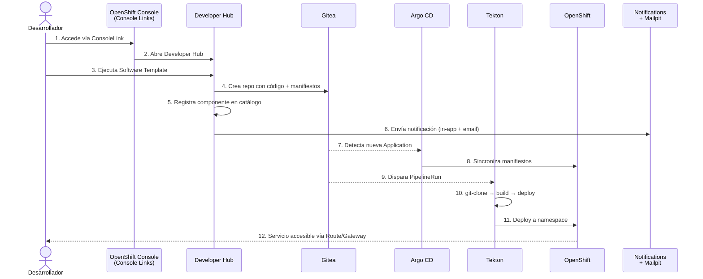
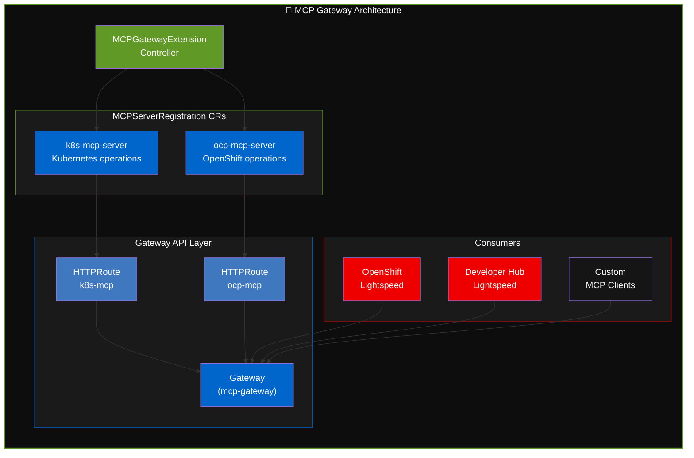
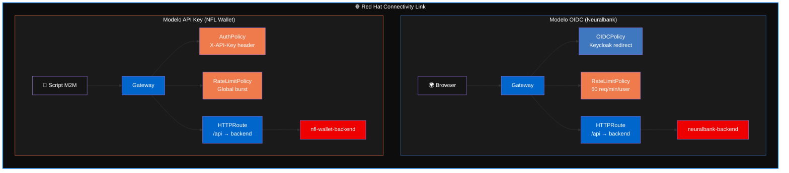

Esta página describe la arquitectura lógica del escenario Neuralbank: cómo encajan Red Hat Developer Hub, GitOps, CI/CD, identidad, exposición segura de APIs, MCP Gateway y asistencia IA frente a un clúster OpenShift.

## Flujo interactivo 3D

> Arrastrá con el mouse para rotar la escena. Las partículas cyan representan el flujo de datos entre componentes: desde el Developer, pasando por Developer Hub, Gitea, ArgoCD/Tekton, hasta el Gateway y los MCP servers, con el flujo paralelo de Lightspeed hacia el LLM.

## Vista de componentes

## Console Links: acceso directo desde OpenShift

La consola de OpenShift incorpora **Console Links** como middleware de navegación, proporcionando acceso directo a todas las herramientas del workshop desde el menú de aplicaciones:

Cada `ConsoleLink` es un Custom Resource de OpenShift que inyecta enlaces en la barra de navegación. El workshop los genera automáticamente desde Helm, asegurando que todas las herramientas estén accesibles sin necesidad de buscar URLs manualmente.

## Flujo principal: de la plantilla al despliegue

## Namespace por usuario y naming convention

Cada usuario recibe su propio namespace. Los componentes usan un **nombre único** con prefijo del owner para evitar colisiones:

| Recurso | Convención | Ejemplo (user1) |
| --- | --- | --- |
| Namespace | `owner-neuralbank` | `user1-neuralbank` |
| Componente catálogo | `owner-name` | `user1-neuralbank-backend` |
| Aplicación ArgoCD | `owner-name` | `user1-neuralbank-backend` |
| Kubernetes ID | `owner-name` | `user1-neuralbank-backend` |

## Red Hat Connectivity Link MCP gateway (Technology Preview)

El workshop integra el **[MCP gateway de Red Hat Connectivity Link](https://docs.redhat.com/en/documentation/red_hat_connectivity_link/1.3/html/installing_the_mcp_gateway/mcp-gateway-install)** (Technology Preview). El operador se instala por OLM desde `redhat-operators` (canal `preview`, versión 0.6.0 TP) y permite exponer y gestionar servidores MCP (Model Context Protocol) a través del API Gateway:

El flujo de MCP Gateway:

1. **`MCPGatewayExtension`** activa el controlador MCP en Kuadrant.
2. **`MCPServerRegistration`** CRs registran cada servidor MCP (k8s-mcp, ocp-mcp).
3. El controlador crea automáticamente `HTTPRoute`s que exponen los MCP servers a través del `Gateway`.
4. **OpenShift Lightspeed** y **Developer Hub Lightspeed** consumen los MCP servers via el Gateway, permitiendo a la IA ejecutar operaciones sobre Kubernetes y OpenShift.

## Connectivity Link: Gateway + Políticas + Modelos de Auth

| Aspecto | Neuralbank (OIDC) | NFL Wallet (API Key) |
|---------|-------------------|---------------------|
| **Auth** | Token JWT (Bearer) via Keycloak | API Key estática (header) |
| **Flujo** | Redirect a login page | Sin redirect, key M2M |
| **Header** | `Authorization: Bearer <token>` | `X-API-Key: <key>` |
| **Rate limit** | Por usuario autenticado | Global (todas las keys) |

## Rol de cada componente

| Componente | Rol |
| --- | --- |
| Developer Hub | Portal del desarrollador: catálogo, plantillas, documentación, Lightspeed, notificaciones y plugins. |
| Console Links | Middleware de navegación en OpenShift Console con acceso directo a todas las herramientas. |
| Gitea | Repositorio Git interno: código fuente, manifiestos y triggers para pipelines. |
| Argo CD | Sincronización GitOps desde Git al clúster; salud y drift visibles en dashboard. |
| Tekton | Pipelines CI/CD como recursos de Kubernetes. Visible en pestaña **CI** del Hub. |
| Keycloak | Identidad y SSO; alimenta OIDCPolicy y acceso al Hub. |
| Dev Spaces | IDEs en el navegador conectados al mismo repo que GitOps y Tekton. |
| MCP gateway (RHCL TP) | Operador OLM `mcp-gateway` (`redhat-operators`, canal `preview`) que expone MCP servers vía Gateway API para consumo por LLMs. |
| Connectivity Link | Gateway API + Istio + Kuadrant: entrada norte-sur, enrutamiento y políticas sobre APIs. |
| Lightspeed | Asistente IA en Developer Hub con RAG y conexión a LLM via LiteLLM. |
| OpenShift Lightspeed | Asistente IA en la consola OpenShift, conectado a MCP servers via MCP Gateway. |
| Notifications + Mailpit | Notificaciones in-app y email sobre el ciclo de vida de componentes. |
