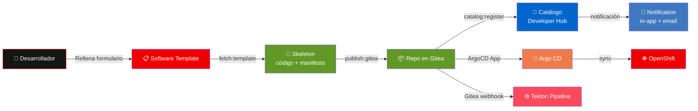

Las **Software Templates** son uno de los pilares de Backstage y de Red Hat Developer Hub. Permiten que la organización empaquete opiniones, estándares y automatización en flujos que el desarrollador ejecuta con un formulario seguro.

## ¿Qué son las Software Templates?

Una Software Template es una definición declarativa que describe:

- **Qué** se va a generar (código, manifiestos, pipelines, catalog-info, etc.).
- **Qué parámetros** debe introducir el usuario (nombre del componente, propietario, visibilidad).
- **Qué pasos** ejecuta el motor de plantillas en secuencia (sustituir archivos, publicar en Git, registrar en el catálogo).

En la práctica, convierten un procedimiento interno de varias horas en un flujo de minutos con trazabilidad y cumplimiento.

## Estructura típica: `template.yaml` y `skeleton/`

En un repositorio de plantillas encontrarás habitualmente:

- **`template.yaml`** (o equivalente): metadatos de la plantilla (`apiVersion`, `kind: Template`), secciones `parameters` y `steps`. Aquí se declara el nombre visible en el Hub, los campos del formulario y las acciones.
- **Directorio `skeleton/`**: árbol de archivos plantilla con **marcadores** que el motor reemplaza con los valores de los parámetros (por ejemplo nombre del proyecto, grupo, rutas de imagen).

El directorio `skeleton` puede contener:

- Código fuente (Java, Node, etc.).
- Manifiestos de Kubernetes/OpenShift (`deployment`, `service`, `route`, recursos de Gateway API).
- `devfile.yaml` para **Dev Spaces**.
- `tekton/pipeline.yaml` u otros recursos de CI/CD.
- `catalog-info.yaml` para el **Backstage Catalog**.

## Parámetros y pasos comunes

Los **parámetros** suelen incluir:

- Nombre del componente o repositorio.
- Propietario (`owner`) o equipo, alineado con el modelo de entidades del catálogo.
- A veces URL del clúster, visibilidad o etiquetas—siempre acotadas por quien mantenga la plantilla.

Los **pasos** frecuentes en ecosistemas GitOps son:

- **`fetch:template`** (o equivalente): copia el `skeleton` y aplica sustituciones desde los parámetros. En este workshop se genera un **nombre único** (`uniqueName`) con formato `owner-name` (e.g. `user1-neuralbank-backend`) para evitar colisiones entre usuarios.
- **`publish:gitea`** / **`publish:github`** / similar: crea o actualiza el repositorio remoto con el contenido generado.
- **`catalog:register`**: registra el componente (y a veces la API) en el Software Catalog para que aparezca en Developer Hub con enlaces y metadatos.
- **Creación de ArgoCD Application** (`http:backstage:request`): crea la aplicación en ArgoCD vía API proxy con el nombre único del componente.
- **Creación de Gitea Webhook** (`http:backstage:request`): configura un webhook para disparar pipelines Tekton ante cada push.
- **Envío de notificación** (`http:backstage:request` a `/api/notifications`): notifica al owner sobre la creación exitosa del componente (in-app y por email).

La nomenclatura exacta depende de los **scaffolder actions** instalados en tu instancia; lo importante es reconocer el patrón: *generar → publicar en Git → registrar → desplegar → notificar*.

## Naming convention multi-usuario

En un entorno compartido con múltiples participantes, es fundamental evitar colisiones de nombres. Las plantillas de este workshop aplican un **prefijo con el username** a todos los recursos que requieren unicidad global:

| Recurso | Nombre base | Nombre único |
| --- | --- | --- |
| Componente en catálogo | `neuralbank-backend` | `user1-neuralbank-backend` |
| Aplicación ArgoCD | `neuralbank-backend` | `user1-neuralbank-backend` |
| Entidad API | `neuralbank-backend-api` | `user1-neuralbank-backend-api` |
| System | `neuralbank` | `user1-neuralbank` |
| ClusterRoleBinding | `neuralbank-backend-trigger-clusterbinding` | `user1-neuralbank-backend-trigger-clusterbinding` |

Los recursos **namespace-scoped** (Deployment, Service, Pipeline, etc.) mantienen el nombre base (`neuralbank-backend`) porque el namespace ya es único por usuario (`user1-neuralbank`).

## Plantillas Neuralbank disponibles en el workshop

Para el caso Neuralbank trabajarás con tres plantillas pensadas para encajar entre sí:

| Plantilla | Propósito |
| --- | --- |
| `customer-service-mcp` | Servidor **MCP** (Model Context Protocol) para atención al cliente; incluye piezas de exposición y políticas asociadas al patrón de conectividad. |
| `neuralbank-backend` | API REST (por ejemplo Quarkus) para **créditos** y dominio bancario; incluye pipeline de build/despliegue y registro de **API** en el catálogo. |
| `neuralbank-frontend` | Interfaz web para **visualización** de créditos, alineada con el backend y el despliegue en OpenShift. |

Cada una implementa un **golden path** distinto pero coherente con el mismo dominio de negocio.

## Flujo de scaffolding



## ¿Qué genera cada plantilla?

En líneas generales, al ejecutar una plantilla Neuralbank obtendrás:

- **Código** listo para compilar y extender (fuentes, `pom.xml` o equivalente, Dockerfile si aplica).
- **Manifiestos** de despliegue en OpenShift (Deployment, Service, Route u objetos de enrutamiento según el caso).
- **Definición de pipeline Tekton** alineada con el repo (para build de imagen y despliegue), con la anotación `janus-idp.io/tekton` para visibilidad en la pestaña **CI** de Developer Hub.
- **`devfile.yaml`** para abrir el proyecto en **Red Hat OpenShift Dev Spaces** con herramientas y comandos preconfigurados.
- **Objetos de connectivity link** donde corresponda—en especial en el escenario **MCP**—: recursos como **Gateway**, **HTTPRoute**, **OIDCPolicy** y **RateLimitPolicy**, para exponer el servicio con autenticación OIDC y límites de tasa.
- **Aplicación ArgoCD** creada automáticamente con nombre único (`owner-name`) y sincronización automática.
- **Webhook en Gitea** configurado para disparar pipelines ante cada push.
- **Notificación** al owner confirmando la creación exitosa del componente.

Además, el **`catalog-info.yaml`** permite que Developer Hub muestre el componente con **owner**, **system** y relaciones hacia APIs y dependencias, usando el nombre único con prefijo de usuario.

## Rendimiento del paso «Publish to Gitea»

El paso `publish:gitea` hace, en este orden: comprobar la organización Gitea, **crear el repositorio** (API), **push del skeleton** (git interno en el backend) y **esperar** hasta 20 s a que la URL `…/src/branch/main` responda 200. El registro en catálogo (`catalog:register`) es un paso **posterior** y no forma parte de «Publish to Gitea».

En el clúster de taller, las integraciones usan `host: gitea-gitea` con `apiBaseUrl` y `baseUrl` apuntando a `http://gitea-http.gitea.svc.cluster.local:3000` (tráfico in-cluster). Los enlaces visibles para el usuario siguen siendo `https://gitea-gitea.<dominio>/…` en las plantillas.

Si el paso tarda decenas de segundos, suele deberse a **Gitea saturado** (p. ej. ~200 ApplicationSets con `scmProvider` sondeando orgs cada minuto) o a **falta de CPU** en el pod Gitea (sin `resources`, las creaciones de repo pueden tardar 6–10 s). Tras fijar requests/limits en el chart y espaciar el requeue del SCM provider, las creaciones suelen bajar a **&lt;1 s** y el paso completo a unos **pocos segundos**.

Verificación rápida desde el pod de Developer Hub:

```bash
scripts/gitea-publish-benchmark.sh
```

O medir solo la API de creación:

```bash
oc exec -n developer-hub deploy/backstage-developer-hub -c backstage-backend -- \
  curl -sS -o /dev/null -w '%{time_total}s\n' -u gitea_admin:openshift \
  -X POST 'http://gitea-http.gitea.svc.cluster.local:3000/api/v1/orgs/ws-user1/repos' \
  -H 'Content-Type: application/json' -d '{"name":"perf-test","auto_init":false}'
```

Valores orientativos: **&lt;1 s** en creación = saludable; **&gt;3 s** = revisar carga de Gitea y recursos del deployment.

## Buenas prácticas al usar plantillas

- Revisa los **valores por defecto** y la **descripción** de cada parámetro antes de crear el componente.
- Tras la creación, abre el **repositorio en Gitea** y confirma que la estructura coincide con lo esperado.
- Localiza en el catálogo la **entidad Component** (y **API** si aplica) para enlazar documentación y pipelines.

Dominar las Software Templates es dominar el **contrato** entre desarrollo y plataforma: tú aportas el contexto de negocio en el formulario; la plataforma aplica el resto de forma repetible.
