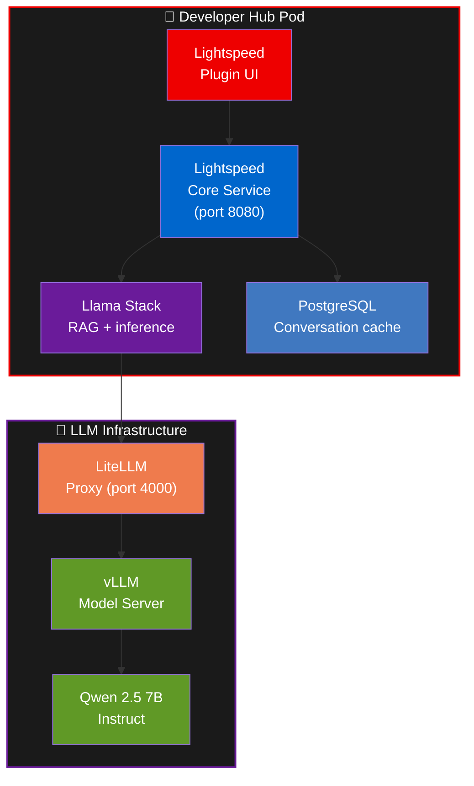
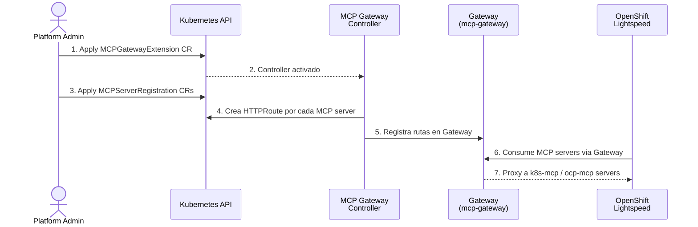
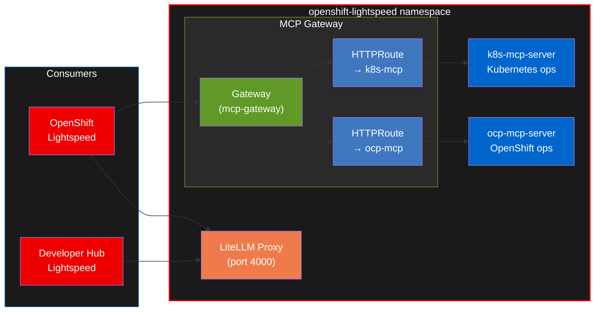
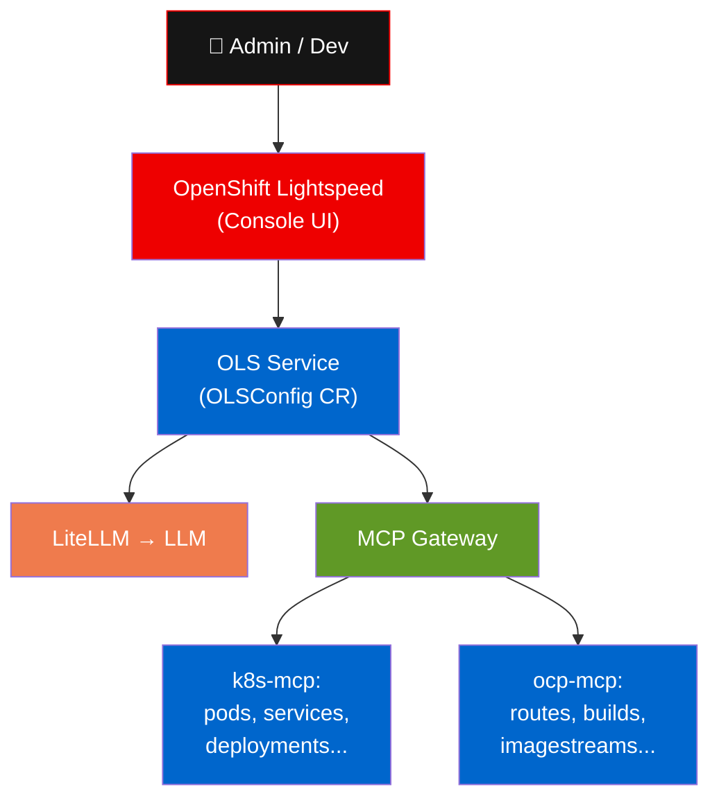
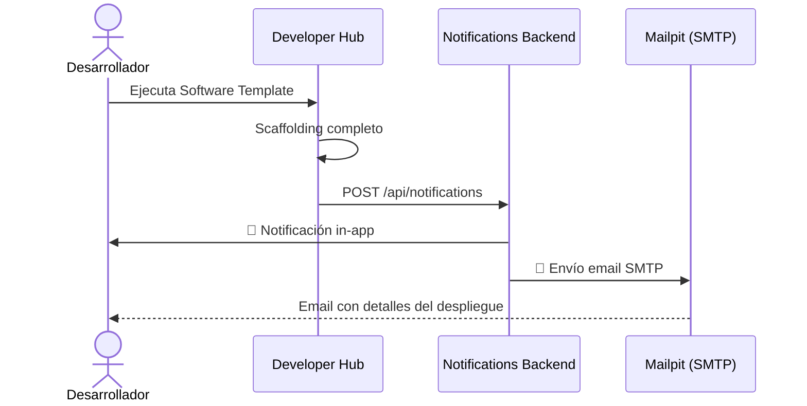

Este módulo cubre tres capacidades integradas que potencian la experiencia del desarrollador: **Developer Hub Lightspeed** como asistente IA, el **[MCP gateway de Red Hat Connectivity Link](https://docs.redhat.com/en/documentation/red_hat_connectivity_link/1.3/html/installing_the_mcp_gateway/mcp-gateway-install)** (Technology Preview) para exponer servidores MCP, y el sistema de **Notificaciones**.

## Developer Hub Lightspeed

Lightspeed es un asistente de IA integrado en Developer Hub. Permite realizar consultas en lenguaje natural sobre la plataforma, las plantillas y las mejores prácticas.

### Arquitectura Lightspeed

Los componentes se ejecutan como sidecars junto al backend de Developer Hub:

- **Lightspeed Core Service**: orquesta las solicitudes y mantiene historial de conversaciones en PostgreSQL.
- **Llama Stack**: gestiona el acceso a modelos y la base de datos vectorial con documentación del producto (RAG).
- **LiteLLM**: proxy unificado que gestiona las conexiones a los modelos de lenguaje (compartido con OpenShift Lightspeed).

### Probar consultas

| Pregunta sugerida | Qué obtendrás |
| --- | --- |
| "How do I create and use Software Templates?" | Flujo de scaffolding y golden paths (Create → Template, parámetros, enlaces generados) |
| "How do I build a backend service for this workshop using Software Templates, and how does it get built with Tekton and deployed with Argo CD?" | Recorrido completo: plantilla → PipelineRun inicial → sync en Argo CD; dónde mirar (CI, app Argo CD, pods) |
| "What components make up the Neuralbank platform?" | Arquitectura backend, frontend y MCP |
| "How are Tekton pipelines configured for CI/CD?" | Configuración de pipelines y triggers |
| "What is the OIDCPolicy pattern in Connectivity Link?" | Patrón de autenticación con Keycloak |

## Red Hat Connectivity Link MCP gateway (Technology Preview)

El **[MCP gateway de Red Hat Connectivity Link](https://docs.redhat.com/en/documentation/red_hat_connectivity_link/1.3/html/installing_the_mcp_gateway/mcp-gateway-install)** (Technology Preview) se instala desde el catálogo `redhat-operators` (canal `preview`). Permite registrar, exponer y gestionar servidores MCP (Model Context Protocol) a través del API Gateway de forma declarativa.

### Flujo interactivo 3D — MCP Gateway

> Arrastrá para rotar. Click en **⛶ Fullscreen** para ver a pantalla completa. Las partículas muestran cómo OpenShift Lightspeed llama herramientas a través del MCP Gateway hacia los servidores MCP y el clúster.

### Flujo de registro MCP

### Componentes del MCP Gateway

### Recursos involucrados

| Custom Resource | Función |
| --- | --- |
| `MCPGatewayExtension` | Activa el controlador MCP en Kuadrant |
| `MCPServerRegistration` | Registra un MCP server y crea su HTTPRoute automáticamente |
| `Gateway` (mcp-gateway) | Punto de entrada para todos los MCP servers registrados |
| `HTTPRoute` | Enruta tráfico del Gateway al MCP server correspondiente |

### OpenShift Lightspeed + MCP

**OpenShift Lightspeed** se beneficia del MCP Gateway al poder ejecutar operaciones sobre el clúster a través de los MCP servers:

Ejemplos de lo que Lightspeed puede hacer con MCP:

- "List all pods in namespace `user1-neuralbank`"
- "Show me the routes in `neuralbank-stack`"
- "Describe the deployment `neuralbank-backend`"
- "What services are running in my namespace?"

## Sistema de notificaciones

Developer Hub notifica a los desarrolladores sobre eventos de la plataforma a través de dos canales:

### Flujo de notificaciones

| Canal | Cómo acceder | Ejemplo |
| --- | --- | --- |
| **In-app** | Icono campana en Developer Hub | "Neuralbank Backend deployed successfully" |
| **Email** | Interfaz web de Mailpit | Email a `userN@developer-hub.local` con detalles |

Las plantillas envían notificaciones automáticas al crear o eliminar componentes, proporcionando visibilidad completa sobre el ciclo de vida.
