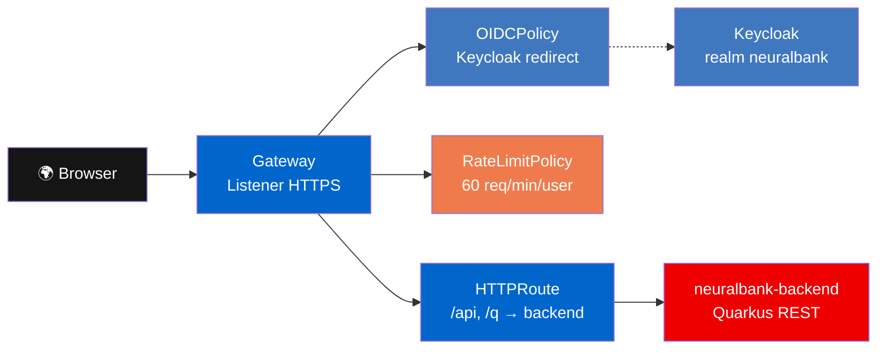

En este módulo explorarás cómo **Red Hat Connectivity Link** protege la API del **neuralbank-stack pre-desplegado** con **OIDCPolicy** (Keycloak) y **RateLimitPolicy**.

> **Importante:** Este módulo cubre el stack `neuralbank-stack` pre-desplegado que usa `OIDCPolicy` con flujo interactivo de Keycloak. Las aplicaciones que scaffoldeaste usan `AuthPolicy` con API Key como método principal (ver módulo 4).

### Flujo 3D — OIDC vs API Key

<div id="auth-flow-3d"></div>
<script>document.addEventListener('DOMContentLoaded', function() { initAuthFlow3D('auth-flow-3d'); });</script>

> Arrastrá para rotar. Click en **⛶ Fullscreen** para pantalla completa. El flujo muestra las dos rutas: OIDC (arriba, via Keycloak) y API Key (abajo, via Secrets).

## Acceso al frontend (flujo OIDC)

El frontend pre-desplegado tiene login interactivo:
- **URL**: `https://neuralbank.YOUR_CLUSTER_DOMAIN`
- **Credenciales**: `YOUR_USER` / `redhat`
- Tras el login, Keycloak redirige de vuelta con un JWT en cookie.

## Arquitectura del patrón OIDC



## Inspeccionar recursos

```bash
oc get gateway,httproute,oidcpolicy,ratelimitpolicy -n neuralbank-stack
```

| Recurso | Función |
|---------|---------|
| **Gateway** | Punto de entrada HTTPS al servicio |
| **HTTPRoute** | Enruta `/api` y `/q` al backend Quarkus |
| **OIDCPolicy** | Autenticación OIDC con Keycloak (Bearer token) |
| **RateLimitPolicy** | Límite de 60 req/min por usuario autenticado |

## Probar sin autenticación

```bash
NEURALBANK_HOST=$(oc get httproute -n neuralbank-stack -o jsonpath='{.items[0].spec.hostnames[0]}')
curl -sk "https://$NEURALBANK_HOST/api/v1/customers" -w "\nHTTP %{http_code}\n"
```

Resultado: **302 Redirect** a la página de login de Keycloak. Sin token, la OIDCPolicy bloquea el acceso.

## Probar con token

```bash
KC_HOST="https://rhbk.YOUR_CLUSTER_DOMAIN"
TOKEN=$(curl -sk "$KC_HOST/realms/neuralbank/protocol/openid-connect/token" \
  -d "client_id=neuralbank" -d "username=robert.anderson@email.com" \
  -d "password=redhat" -d "grant_type=password" | python3 -c "import json,sys; print(json.load(sys.stdin)['access_token'])")

curl -sk "https://$NEURALBANK_HOST/api/v1/customers" \
  -H "Authorization: Bearer $TOKEN" | python3 -m json.tool | head -20
```

Resultado: **200 OK** con datos de clientes en JSON.

## Verificar en Developer Hub

1. Navega a **Catalog** → busca **neuralbank-stack**.
2. Explora las pestañas: **Topology**, **API**, **Kubernetes**.
3. En **API** verás el OpenAPI spec del backend.
