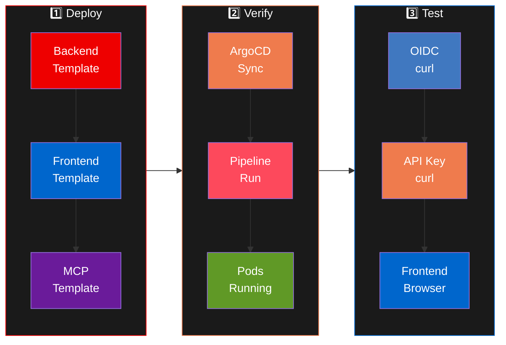

Actividad práctica consolidada: despliega el stack Neuralbank completo y verifica que todo funcione.

## Flujo completo



## Step 1: Deploy Backend

1. Abre **Developer Hub** → **Create** → selecciona **"Neuralbank: Backend API"**.
2. Completa: **Name** = `neuralbank-backend`, **Owner** = `YOUR_USER`.
3. Click **Create** y espera que completen todos los pasos.

## Step 2: Deploy Frontend

1. **Create** → **"Neuralbank: Frontend"**.
2. **Name** = `neuralbank-frontend`, **Owner** = `YOUR_USER`.

## Step 3: Deploy Customer Service MCP

1. **Create** → **"Customer Service MCP"**.
2. **Name** = `customer-service-mcp`, **Owner** = `YOUR_USER`.

## Step 4: Verificar en ArgoCD

```bash
oc get applications -n openshift-gitops | grep YOUR_USER
```

Las tres aplicaciones deben mostrar `Synced` y `Healthy`.

## Step 5: Verificar pipelines

```bash
oc get pipelinerun -n YOUR_USER-neuralbank
```

## Step 6: Test APIs scaffoldeadas (API Key)

Las aplicaciones scaffoldeadas usan **API Key** como método principal de autenticación:

```bash
# Obtener la API Key del backend
API_KEY=$(oc get secret -n YOUR_USER-neuralbank \
  -l "app=neuralbank-backend,kuadrant.io/apikey=true" \
  -o jsonpath='{.items[0].data.api_key}' | base64 -d)

# Test backend
curl -s -H "X-API-Key: $API_KEY" \
  "https://YOUR_USER-neuralbank-backend.YOUR_CLUSTER_DOMAIN/api/customers" \
  | python3 -m json.tool | head -10
```

## Step 7: Test OIDC (neuralbank-stack pre-desplegado)

El stack pre-desplegado usa `OIDCPolicy` con **flujo interactivo de Keycloak**. Referencia completa: [Connectivity Link: OIDC](10-explore-connectivity-link-oidc.html).

**Frontend con OIDC**: Abre `https://neuralbank.YOUR_CLUSTER_DOMAIN` — serás redirigido al login de Keycloak (`YOUR_USER` / `redhat`).

```bash
# Test programático con Bearer token
TOKEN=$(curl -s -X POST \
  "https://rhbk.YOUR_CLUSTER_DOMAIN/realms/neuralbank/protocol/openid-connect/token" \
  -d "client_id=neuralbank-frontend" -d "username=YOUR_USER" \
  -d "password=redhat" -d "grant_type=password" \
  | python3 -c "import json,sys; print(json.load(sys.stdin)['access_token'])")

curl -s "https://neuralbank.YOUR_CLUSTER_DOMAIN/api/v1/customers" \
  -H "Authorization: Bearer $TOKEN" | python3 -m json.tool | head -10
```

## Step 8: Test API Key (NFL Wallet)

Referencia completa: [Connectivity Link: API Key](11-explore-connectivity-link-apikey.html).

```bash
NFL_KEY=$(oc get secret nfl-wallet-apikey-admin -n nfl-wallet-prod \
  -o jsonpath='{.data.api_key}' | base64 -d)

curl -s -H "X-API-Key: $NFL_KEY" \
  "https://nfl-wallet.YOUR_CLUSTER_DOMAIN/api/v1/customers" \
  | python3 -m json.tool | head -10
```

## Step 9: Verificar frontend scaffoldeado

El frontend scaffoldeado usa **API Key** (sin login OIDC):

- **URL**: `https://YOUR_USER-neuralbank-frontend.YOUR_CLUSTER_DOMAIN`
- Ingresar la API Key en el campo de input del SPA

## Step 10: Explorar en Developer Hub

1. **Catalog** → busca tus componentes `YOUR_USER-*`.
2. Verifica las pestañas: **CI** (pipelines), **CD** (ArgoCD), **Topology**, **Kubernetes**, **API**, **Docs**.
3. Revisa las **Notificaciones** (campana) y los emails en **Mailpit**.
4. Prueba **Lightspeed**: pregunta sobre tus componentes.

## Modelos de autenticación

| | `neuralbank-stack` (pre-desplegado) | Apps scaffoldeadas | NFL Wallet |
|---|---|---|---|
| **Tipo de AuthPolicy** | `OIDCPolicy` CR | `AuthPolicy` (API Key + JWT) | `AuthPolicy` (API Key) |
| **Login interactivo** | ✅ Redirect a Keycloak | ❌ API Key manual | ❌ API Key manual |
| **URL Frontend** | `neuralbank.YOUR_CLUSTER_DOMAIN` | `YOUR_USER-neuralbank-frontend.YOUR_CLUSTER_DOMAIN` | N/A |
| **Credenciales** | `YOUR_USER` / `redhat` | API Key de Secret | API Key de Secret |
